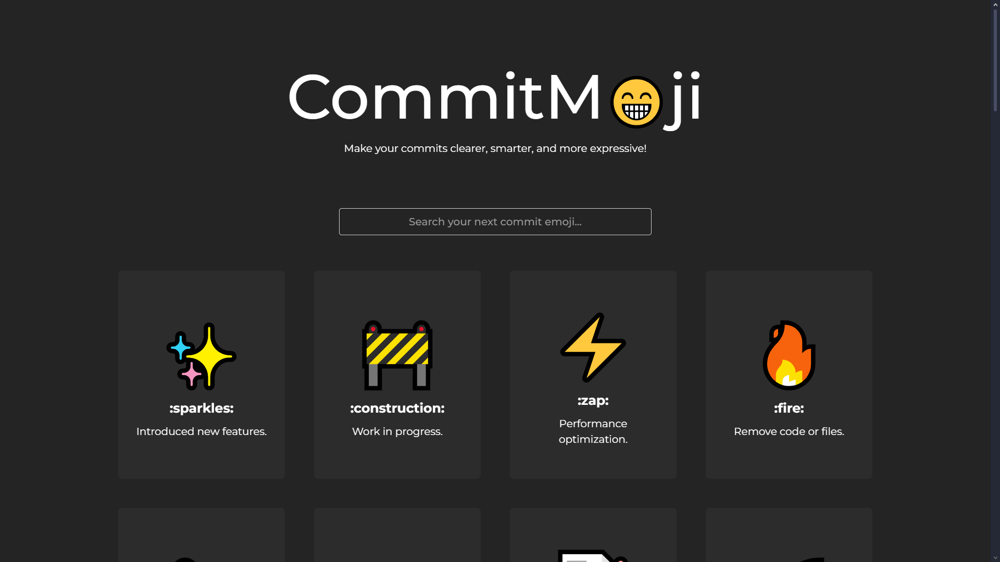

# CommitMoji ✨

### Make your commits clearer, smarter, and more expressive.

https://commitmoji.vercel.app

CommitMoji is your go-to reference for using emojis in Git commit messages. Whether you're fixing bugs, adding features, or writing docs, CommitMoji helps you tag your commits with meaningful icons that improve readability, team communication, and version history clarity.

Make every commit count — with clarity and flair. 🚀

## Made with ReactJS and TailwindCSS, powered by VITE⚡



🔹 Browse a curated list of common Git emojis

🔹 Get usage examples for each emoji

🔹 Copy emoji codes in one click

🔹 Learn best practices for conventional commits

🔹 Works great for solo devs and teams alike

## 📄 Installation Intructions -

Make sure you have - 

- Node.js v18+
- npm or pnpm

Then, download, unzip and open the folder in your text editor.

1. Install the dependencies -
```
>> npm install
```
2. Run the development environment -
```
>> npm run dev
```
3. Open localhost in your brower and Done!

## 🔧 Dependencies -

1. tailwindCSS v4.1.11
1. react v19.1.0
1. react-dom v19.1.0
1. vite v7.0.0
1. typescript v5.8.3
1. eslinkt v9.29.0

## 📝 License
This project is licensed under the MIT License.

Checkout [LICENSE.md](https://github.com/prathmesh-ka-github/CommitMoji/blob/main/LICENSE) for more info.

## 🤝🏻 Contribute
1. Fork this repository.
1. Create your own branch.
1. Commit changes.
1. Submit a pull request.

your code will be reviewed and request will be merged!

### Top contributors - 
- [abhiishekk02](https://abhiishekk02.github.io/AG.Dev/)
- [SaisatwikBiku](https://rococo-horse-a3ea9b.netlify.app)

## 💛 Appreciation
Give this repo a star! Submit issues if you find bugs! 

Happy coding <3 